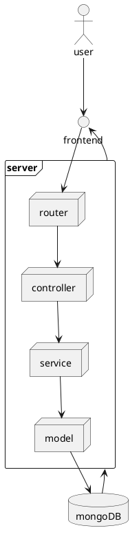

# Architecture Design

## Purpose

Reconstruct the list and detail page of the jianshu website by NodeJS, mongodb is used for data storage, docker is used for stand-alone deployment, and deployment execution script need to be provided.

## Solution

### Brief Description

In order to reconstruct a system like jianshu website, I chose Koa.js as server library and mongoose as the database connection library to simplify the work flow and development flow, lower the development and maintenance spend.

The whole project build up with MVC structure and Domain Driven Design, which will improve the robust of the code. The following developer can do the write new interface in the same way. Each domain or so call each entity will has its own `controller`, `service`, `model` and `type` files. Every time you want to add a new entity or new domain, you need to new corresponding files in the folders mentioned above.

### System Flow

#### System Design



#### Entity Relationship

```plantuml
@startuml

@enduml
```

#### Key-Value Map

## Folder Structure

```
 src
  ├── api
  │   └── v1
  ├── configs
  ├── controllers
  ├── models
  ├── services
  ├── types
  └── utils
```

This server uses [M-V-C](https://en.wikipedia.org/wiki/Model%E2%80%93view%E2%80%93controller) structure and [Domain Driven Design](https://en.wikipedia.org/wiki/Domain-driven_design) to build up the folder structure.

- api -> store the routers, which are written in RESTful style.
- configs -> store some basic config, like http exception, site config and so on.
- controllers -> the controllers for corresponding routes in order to response the request.
- models -> the models of data.
- services -> the services to get data from database.
- types -> the types for each domain.
- utils -> common utils function used in the project.

# Tech Stack

# FAQ

## How to use dockerfile?

To build the Docker image with the updated Dockerfile, use the following command:

```bash
docker build -t jianshu-server .
```

This command builds the Docker image and tags it with the name jianshu-server.

To run the Docker container with the updated image, use the following command:

```bash
docker run -p 3000:3000 --name jianshu-server-container jianshu-server
```

This command maps port 3000 on the host machine to port 3000 in the container, names the container jianshu-server-container, and runs the jianshu-server Docker image. You should now be able to access the Koa app in your web browser at http://localhost:3000.

## macOS MongoDB install via Homebrew

source: https://stackoverflow.com/questions/57856809/installing-mongodb-with-homebrew

1. Install the Xcode command-line tools and the Homebrew from https://brew.sh/#install

```bash
xcode-select --install
```

2. Tap the MongoDB Homebrew Tap:

```bash
brew tap mongodb/brew
```

3. Verify installation prerequisites in the macOS Terminal:

```bash
brew tap | grep mongodb
```

4. install MongoDB

```bash
brew install mongodb-community@4.4
```

Note: The installation includes:

- The mongod server,
- The mongos sharded cluster query router,
- The mongo shell

Note: Start mongoDB via `brew services`

```bash
brew services start mongodb-community
brew services stop mongodb-community
brew services restart mongodb-community
```
